# gabrxgomes

--[ 0x01. Ghost Profile ]--------------------------------------------------------
> Gabriel — Backend Developer, São Paulo, Brazil.
> Requirements Analyst @ InfoJobs Brasil (Pandapé ATS): REST API integrations,
> webhook configuration, OAuth2/SAML2 SSO, production incident resolution.
> "I am not what I was made, I am what I choose to become."

--[ 0x02. Cyberbrain // Tech Stack ]----------------------------------------------
* Languages:   Python, Kotlin
* Frameworks:  Spring / Spring Boot, REST APIs
* Data:        SQL, PostgreSQL
* Infra:       Docker, Linux
* Focus:       Backend Engineering, System Design, API Architecture

--[ 0x03. Independent Research ]---------------------------------------------------
> Complexity Gap — empirical study of the gap between Big O complexity and
> real-world performance of graph search algorithms (BFS, DFS, Dijkstra, A*,
> Bidirectional) across 6 graph topologies. Open data, reproducible experiments.
* Site:  -> https://gabrxgomes.github.io/complexity-gap
* Repo:  -> https://github.com/gabrxgomes/complexity-gap

--[ 0x04. Currently Training ]------------------------------------------------------
* Application Security — HackTheBox, path toward BSCP / eWPT
* Algorithms & data structures in Java
* Go as a backend differentiator

--[ 0x05. Uplink ]-------------------------------------------------------------------
* GitHub:    github.com/gabrxgomes
* LinkedIn:  linkedin.com/in/gabriel-gomes-641950163
* Email:     gabrielnasciment123@hotmail.com
* Twitter:   twitter.com/TheGabDev
* Status:    open to remote backend / appsec roles (Canada, Germany)

---

  standalone complex // EOF

